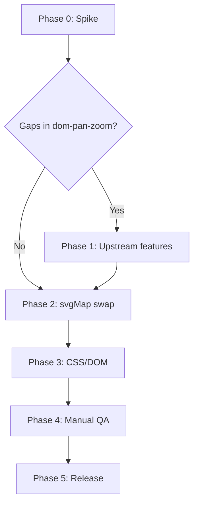

# Migration plan: svg-pan-zoom → dom-pan-zoom

## Goal

Replace the sole runtime dependency (`svg-pan-zoom`) with [dom-pan-zoom](https://github.com/stephanwagner/dom-pan-zoom), which applies CSS transforms to a DOM element instead of manipulating SVG internals. The public svgMap API (`minZoom`, `initialZoom`, `zoomContinent`, etc.) should stay stable; only the internal pan/zoom adapter changes.

---

## Current integration (audit)

All pan/zoom logic lives in one place: `src/js/core/svg-map.js`.

| Area | Current behavior (`svg-pan-zoom`) |
|------|----------------------------------|
| Init | `svgPanZoom(this.mapImage, { ... })` — pan/zoom targets the `<svg>` directly |
| DOM | `mapWrapper` (`.svgMap-map-wrapper`) already wraps `mapImage`; controls are siblings, not children of the SVG |
| Options mapped | `minZoom`, `maxZoom`, `zoomScaleSensitivity`, `dblClickZoomEnabled`, `mouseWheelZoomEnabled`, `fit` + `center` |
| Custom pan limits | `beforePan` with 85% gutter via `getSizes()` |
| Initial state | `zoom(initialZoom)` or `zoomAtPointBy(initialZoom, initialPan)` |
| Controls | `zoomIn` / `zoomOut`, `reset()`, `getZoom()` |
| Continents | `reset()` + `zoomAtPoint(continent.zoom, continent.pan)` — pan in **SVG viewBox coords** (2000×1001) |
| Resize | `mapPanZoom.resize()` when `resetZoomOnResize` is true |
| Events | `onZoom` → `setControlStatuses()` |

```javascript
// Init pan zoom (src/js/core/svg-map.js)
this.mapPanZoom = svgPanZoom(this.mapImage, {
  zoomEnabled: this.options.allowInteraction,
  panEnabled: this.options.allowInteraction,
  fit: true,
  center: true,
  minZoom: this.options.minZoom,
  maxZoom: this.options.maxZoom,
  zoomScaleSensitivity: this.options.zoomScaleSensitivity,
  // ...
  beforePan: function (oldPan, newPan) {
    var gutterWidth = me.mapWrapper.offsetWidth * 0.85;
    // ...
  }
});
```

---

## API gap analysis

| svgMap need | `dom-pan-zoom` today | Risk |
|-------------|----------------------|------|
| Fit + center on load | `center: true`, `initialZoom: 'contain'` | Low — tune `bounds` (`contain` vs `cover`) to match current “fit” feel |
| `zoomAtPoint` / `zoomAtPointBy` | No equivalent — uses `panTo(x%, y%)` + `zoomTo()` | **High** — continent presets and `initialPan` need conversion or new API |
| `reset()` | No `reset()` — compose `center()` + `zoomTo(initialZoom)` | Medium |
| `resize()` | No `resize()` — bounds/minZoom not recalculated on container resize | **High** — needed for `resetZoomOnResize` |
| `allowInteraction: false` | No `panEnabled` / `zoomEnabled` | Medium — wrapper CSS or option in dom-pan-zoom |
| `dblClickZoomEnabled` | Not built-in | Medium — small handler in svgMap or dom-pan-zoom |
| `mouseWheelZoomWithKey` | Not built-in; svgMap only shows a notice today | Medium — must gate dom-pan-zoom’s `wheel` handler |
| Custom 85% gutter `beforePan` | `bounds: 'contain'/'cover'` only | Medium — behavior will differ unless extended |
| `zoomScaleSensitivity` | `zoomSpeedWheel` (note: README says `zoomWheelSpeed`) | Low — map values empirically |

Because both libraries are by the same author, the highest-risk gaps (`resize`, `zoomAtPoint`, interaction toggles) are good candidates to add to **dom-pan-zoom first**, then consume from svgMap.

---

## Recommended phases

### Phase 0 — Spike (1–2 days)

1. Branch: `feat/dom-pan-zoom-migration`.
2. `npm install dom-pan-zoom` (pin latest, e.g. `^0.1.4`).
3. Minimal swap in `createMap()`:

```javascript
import domPanZoom from 'dom-pan-zoom';

this.mapPanZoom = new domPanZoom({
  wrapperElement: this.mapWrapper,
  panZoomElement: this.mapImage,
  minZoom: this.options.minZoom,
  maxZoom: this.options.maxZoom,
  bounds: 'contain',
  center: true,
  initialZoom: this.options.initialZoom,
  zoomSpeedWheel: this.options.zoomScaleSensitivity, // tune
  onZoom: () => this.setControlStatuses()
});
```

4. Manually test: HTML demo (`demo/html/`), wheel zoom, pinch on mobile, zoom buttons, continent selector, `resetZoomOnResize`, `allowInteraction: false`.
5. Document visual/behavior deltas (pan limits, initial framing, continent jumps).

**Exit criteria:** Clear list of dom-pan-zoom changes vs svgMap-only workarounds.

---

### Phase 1 — dom-pan-zoom enhancements (if needed)

Prioritize upstream changes in [dom-pan-zoom](https://github.com/stephanwagner/dom-pan-zoom) so svgMap stays thin:

| Feature | Suggested API |
|---------|----------------|
| Resize / relayout | `resize()` or `update()` — recompute `minZoom` from `bounds`, keep pan/zoom ratio |
| Reset | `reset({ zoom, panX, panY })` |
| Zoom at point | `zoomToAt(zoom, { x, y }, instant)` — pixel or % coords |
| Disable interaction | `interactive: false` or `panEnabled` / `zoomEnabled` |
| Modifier wheel zoom | `mouseWheelRequiresKey: true` + hook into existing svgMap key UI |
| Double-click zoom | `dblClickZoomEnabled` |

Release dom-pan-zoom patch (e.g. `0.1.5`) before finishing svgMap.

---

### Phase 2 — svgMap core migration

**Files to touch:**

| File | Change |
|------|--------|
| `package.json` | `svg-pan-zoom` → `dom-pan-zoom` |
| `src/js/core/svg-map.js` | Import, init, `zoomMap`, `mapReset`, `zoomContinent`, `setControlStatuses` |
| `src/scss/map.scss` | Ensure `.svgMap-map-image` has explicit dimensions (dom-pan-zoom recommends this); verify `transform` doesn’t break layout |
| `rollup.config.js` | No change expected — same resolve/commonjs pipeline |
| `README.md`, `CLAUDE.md` | Attribution + option notes |
| `demo/*/package-lock.json` | Refresh after root dependency change |

**Method mapping:**

| svg-pan-zoom | dom-pan-zoom |
|--------------|--------------|
| `zoomIn()` / `zoomOut()` | `zoomIn()` / `zoomOut()` |
| `getZoom()` | `getZoom()` |
| `reset()` + re-apply initial | `reset()` or `center(true)` + `zoomTo(initialZoom, true)` + pan |
| `zoom(initialZoom)` | `zoomTo(initialZoom, true)` |
| `zoomAtPointBy(zoom, {x,y})` | `zoomToAt(zoom, point)` or converted `panTo` + `zoomTo` |
| `resize()` | `resize()` |
| `onZoom` | `onZoom` |

**Continent coordinates:** Today they are SVG viewBox pixels (e.g. Africa `{ x: 454, y: 250 }`, `zoom: 1.9`). Add a small helper:

```javascript
viewBoxToPanPercent(x, y) {
  // viewBox is 0 0 2000 1001
  return { x: (x / 2000) * 100, y: (y / 1001) * 100 };
}
```

Calibrate against the old behavior; you may need to store continent presets as `%` after migration.

**`allowInteraction: false`:** Either dom-pan-zoom disables listeners, or svgMap sets `pointer-events: none` on `mapWrapper` and keeps controls disabled (already partially done).

**`mouseWheelZoomWithKey`:** Gate zoom in dom-pan-zoom’s wheel handler when `!document.body.classList.contains('svgMap-zoom-key-pressed')`, reusing existing key listeners in `addMouseWheelZoomWithKeyEvents()`.

---

### Phase 3 — CSS and DOM

1. Confirm structure: `wrapperElement = mapWrapper`, `panZoomElement = mapImage` (controls stay untransformed).
2. Review `.svgMap-map-wrapper` (`padding-top: 50%` + absolutely positioned SVG) — dom-pan-zoom uses `clientWidth` / `clientHeight`; verify after layout.
3. Check persistent tooltips and pins (inside SVG) still scale correctly with transform (expected).
4. Optional: `will-change: transform` on `.svgMap-map-image` if jank appears.

---

### Phase 4 — Verification

No automated pan/zoom tests exist today (`node test/assets.js` only checks dist files).

**Manual checklist:**

- [ ] Default map load (fit, center, `initialZoom: 1.06`)
- [ ] Zoom in/out buttons + disabled states at min/max
- [ ] Reset button (`showZoomReset`)
- [ ] Wheel zoom, with and without `mouseWheelZoomWithKey`
- [ ] Double-click zoom (`dblClickZoomEnabled`)
- [ ] Continent selector for all regions (incl. “World” reset)
- [ ] `initialPan` non-zero
- [ ] `resetZoomOnResize` + window resize
- [ ] `allowInteraction: false`
- [ ] Touch pan + pinch on mobile
- [ ] Country hover/click/tooltips while panned/zoomed
- [ ] Demos: `demo/html/`, `demo/es6/`, `demo/react/`
- [ ] UMD CDN usage (`dist/svg-map.umd.min.js`)

**Build:**

```bash
npm run build && node test/assets.js
```

---

### Phase 5 — Release

1. **Version:** Minor bump (e.g. `2.22.0`) if behavior is equivalent; major if continent/`initialPan` semantics change.
2. **Changelog:** Note dependency swap, any pan-boundary differences, mobile pinch improvement.
3. **README:** Replace svg-pan-zoom credit with dom-pan-zoom link.

---

## Suggested task breakdown



| # | Task | Owner | Depends on |
|---|------|-------|------------|
| 1 | Spike branch + side-by-side demo | svgMap | — |
| 2 | `resize()` in dom-pan-zoom | dom-pan-zoom | Spike |
| 3 | `zoomToAt()` / `reset()` in dom-pan-zoom | dom-pan-zoom | Spike |
| 4 | Interaction toggles + wheel key gate | dom-pan-zoom or svgMap | Spike |
| 5 | Swap dependency + adapter in `svg-map.js` | svgMap | 2–4 |
| 6 | Recalibrate continent presets | svgMap | 5 |
| 7 | SCSS pass | svgMap | 5 |
| 8 | Docs + changelog | svgMap | 5 |
| 9 | Full manual QA | svgMap | 5–8 |

---

## Risks and mitigations

| Risk | Mitigation |
|------|------------|
| Continent zoom feels wrong | Keep old presets in a branch; convert with helper; tune visually |
| Pan bounds differ from 85% gutter | Accept `bounds: 'contain'` or add `gutter` option to dom-pan-zoom |
| Resize breaks zoom | Implement `resize()` upstream before shipping |
| Wheel + key conflict | Single wheel handler in dom-pan-zoom with optional key check |
| Bundle size regression | Compare `dist/svg-map.umd.min.js` before/after |

---

## Out of scope (unless you want them)

- Changing public option names (`zoomScaleSensitivity` could alias `zoomSpeedWheel` internally only).
- Automated E2E tests (worth adding later, e.g. Playwright on `demo/html/`).
- Removing legacy UMD filenames (`svgMap.js`).

---

## Summary

The migration is **localized** (mostly `svg-map.js` + `package.json`), but **not a drop-in swap**: coordinate systems and missing `resize` / `zoomAtPoint` / interaction flags need attention. The fastest path is a short spike, then small dom-pan-zoom releases for parity, then wire svgMap to the new API while keeping the existing options surface unchanged.
